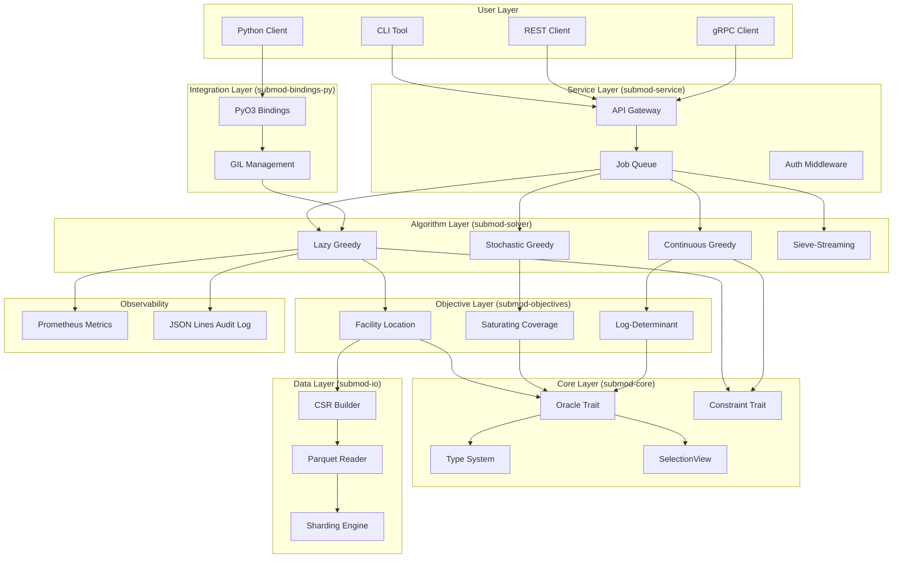
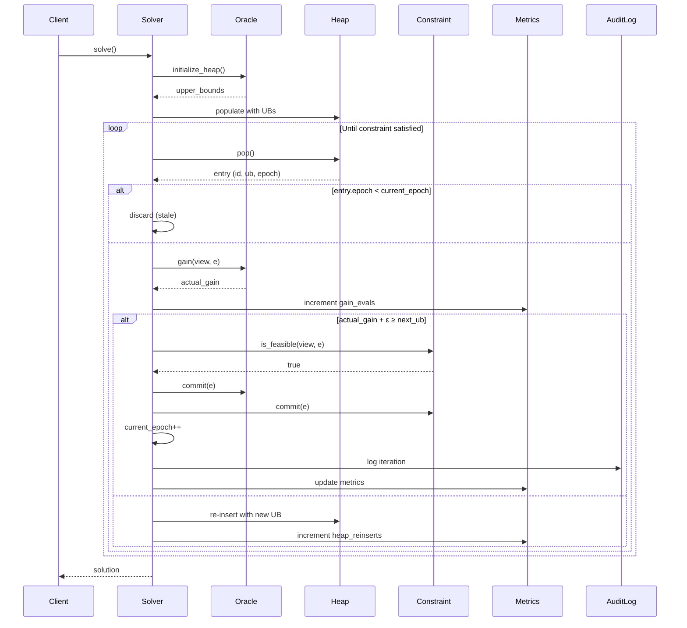
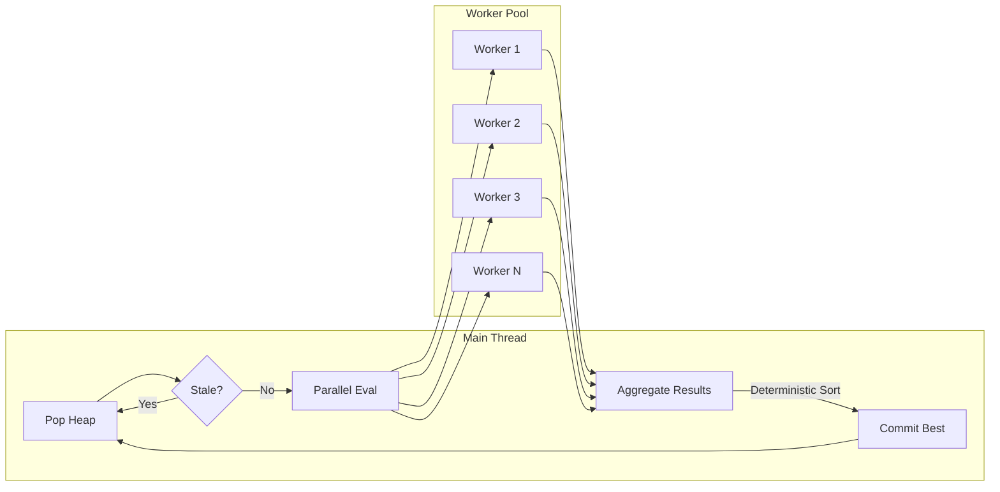
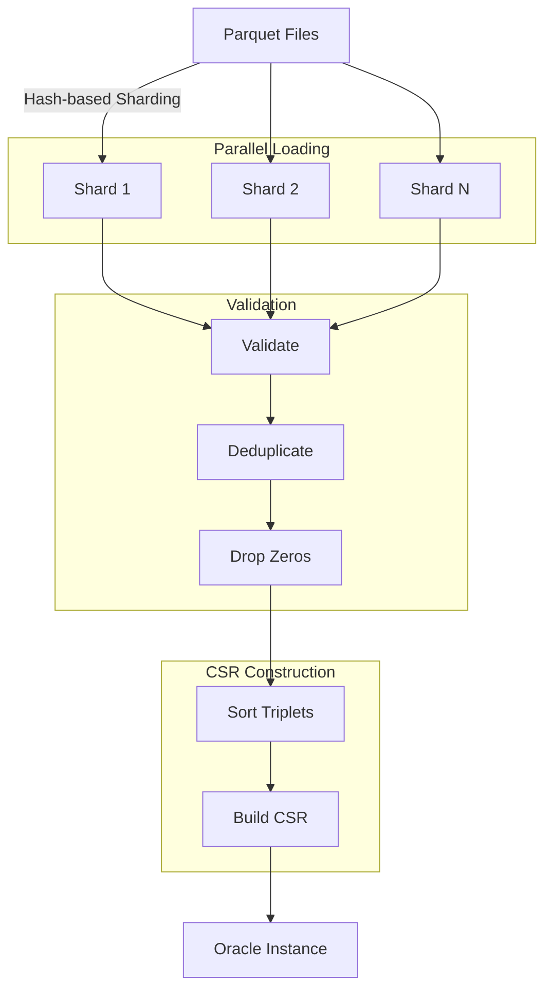
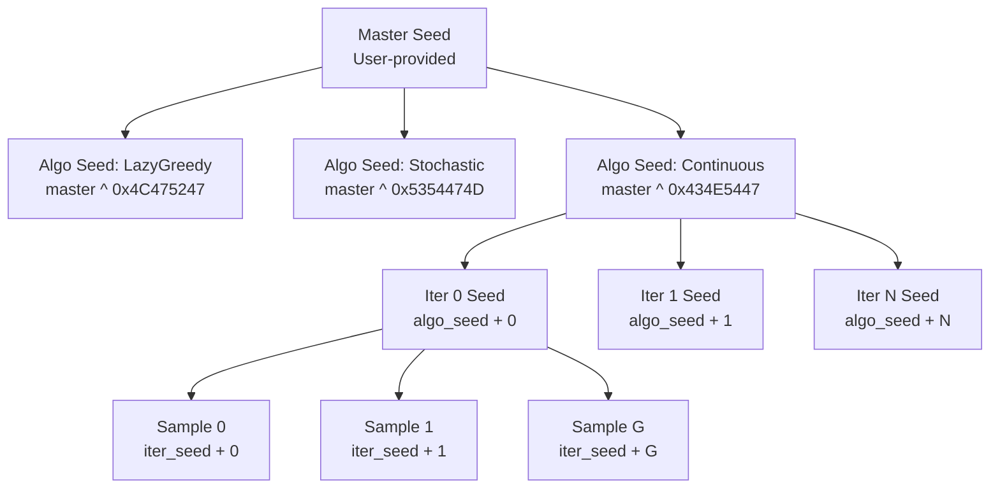

# Technical Design: Submodular Optimization Platform

## Executive Summary

This document describes the technical design for a production-grade submodular optimization platform implemented in Rust. The platform addresses large-scale subset selection problems with provable approximation guarantees, supporting millions of candidates, millions of demand points, and billions of non-zero interactions.

**Design Principles:**
1. **Theoretical Rigor:** Maintain (1-1/e) ≈ 0.632 approximation guarantees
2. **Thread Safety:** Enable safe parallel evaluation through immutable oracle interfaces
3. **Deterministic Execution:** Ensure reproducible results across platforms
4. **Numerical Stability:** Handle floating-point arithmetic robustly with graceful degradation
5. **Production Readiness:** Provide comprehensive monitoring, auditing, and failure recovery

**Technology Stack:** Rust 2021 Edition with PyO3 Python bindings, gRPC/REST service layer, Parquet/Arrow data interchange, Prometheus metrics, and JSON Lines structured logging.

---

## 1. High-Level Architecture

### 1.1 System Overview



### 1.2 Crate Organization

The platform consists of 6 Rust crates organized as a workspace:

**Dependency Hierarchy:**
```
submod-service (gRPC/REST)
    ├── submod-bindings-py (PyO3)
    │   └── submod-solver (algorithms)
    │       ├── submod-objectives (oracles)
    │       │   ├── submod-core (traits + types)
    │       │   └── submod-io (Parquet + CSR)
    │       └── submod-core
    └── submod-solver
```

---

## 2. Key Design Decisions

### 2.1 SelectionView as Canonical Representation

**Decision:** Use `SelectionView` with `FixedBitSet` as the canonical representation of current selection, not `Vec<ItemId>`.

**Rationale:**
- O(1) membership testing (`view.contains(e)`)
- Thread-safe immutable snapshots for parallel evaluation
- Efficient cloning for view-based gradient estimation (Continuous Greedy)
- Deterministic iteration order (sorted by ItemId)

**Implementation:**
```rust
pub struct SelectionView {
    selected: FixedBitSet,
    size: usize,
    sorted_cache: Option<Vec<ItemId>>,
}

impl SelectionView {
    pub fn contains(&self, e: ItemId) -> bool {
        self.selected.contains(e as usize)
    }

    pub fn iter(&self) -> impl Iterator<Item = ItemId> + '_ {
        self.selected.ones().map(|i| i as ItemId)
    }
}
```

### 2.2 Thread-Safe Oracle Interface

**Decision:** Split oracle interface into immutable `gain(&self)` and mutable `commit(&mut self)`.

**Rationale:**
- Immutable `gain()` enables safe concurrent evaluation via `&self`
- Mutable `commit()` enforces exclusive access for state updates
- No data races or synchronization primitives needed
- Natural Rust ownership semantics

**Implementation:**
```rust
pub trait SubmodularOracle: Send + Sync {
    fn gain(&self, view: &SelectionView, e: ItemId) -> f64;
    fn commit(&mut self, e: ItemId);
    fn universe_size(&self) -> usize;

    // Optional optimization hooks
    fn upper_bound(&self, e: ItemId) -> f64 { f64::INFINITY }
    fn gain_batch(&self, view: &SelectionView, candidates: &[ItemId]) -> Vec<f64> {
        candidates.iter().map(|&e| self.gain(view, e)).collect()
    }
    fn fork(&self) -> Option<Box<dyn SubmodularOracle>> { None }
}
```

### 2.3 Epoch-Based Lazy Evaluation

**Decision:** Use epoch counter to invalidate stale heap entries instead of removing them.

**Rationale:**
- Standard lazy greedy requires expensive heap removal/update operations
- Epoch-based approach: increment counter on commit, discard entries with `entry.epoch < current_epoch`
- Achieves 5-10% evaluation counts of standard greedy
- Simpler implementation, no heap decrease-key operations

**Implementation:**
```rust
struct HeapEntry {
    item_id: ItemId,
    upper_bound: f64,
    epoch: u64,
}

struct LazyGreedy {
    heap: BinaryHeap<HeapEntry>,
    current_epoch: u64,
}

fn select_next(&mut self) -> Option<ItemId> {
    loop {
        let entry = self.heap.pop()?;
        if entry.epoch < self.current_epoch {
            continue; // Stale, discard
        }
        let actual_gain = self.oracle.gain(&self.view, entry.item_id);
        if actual_gain + EPSILON >= self.peek_next_ub() {
            self.current_epoch += 1; // Invalidate all entries
            return Some(entry.item_id);
        } else {
            self.heap.push(HeapEntry {
                item_id: entry.item_id,
                upper_bound: actual_gain,
                epoch: self.current_epoch,
            });
        }
    }
}
```

### 2.4 View-Based Gradient Estimation

**Decision:** Continuous Greedy uses temporary `SelectionView` snapshots for gradient estimation, never mutates oracle during sampling.

**Rationale:**
- Multilinear extension F(x) = E[f(R(x))] where R(x) samples each i with prob x_i
- Gradient estimation requires evaluating f(R ∪ {i}) - f(R) for multiple samples
- Creating temporary views preserves oracle immutability
- Enables thread-safe parallel gradient estimation

**Implementation:**
```rust
fn estimate_gradient(&self, x: &[f64], G: usize) -> Vec<f64> {
    let mut gradient = vec![0.0; self.n];

    for _ in 0..G {
        let R = self.sample_from_x(x); // Create temporary SelectionView
        for i in 0..self.n {
            if !R.contains(i) {
                let mut R_plus_i = R.clone();
                R_plus_i.insert(i);
                gradient[i] += self.oracle.gain(&R_plus_i, i);
            }
        }
    }

    gradient.iter_mut().for_each(|g| *g /= G as f64);
    gradient
}
```

### 2.5 Defense-in-Depth Numerical Stability

**Decision:** Apply 5 layers of numerical safety for Log-Determinant objective.

**Rationale:**
- Log-Determinant (diversity optimization) is numerically sensitive
- Cholesky decomposition accumulates errors rapidly
- Layered defense provides graceful degradation path

**5-Layer Strategy:**

| Layer | Defense | Trigger | Action |
|-------|---------|---------|--------|
| 1 | Epsilon Regularization | Always | Add εI to kernel matrix (ε ∈ [10⁻⁶, 10⁻⁴]) |
| 2 | Safe Schur Clipping | Schur diagonal d < ε | Clip d_safe = max(d, ε·0.1) |
| 3 | log1p for Small Values | d < 0.01 · mean(diag) | Use log1p(d-1) instead of log(d) |
| 4 | Full Recomputation | NaN detected in update | Recompute full Cholesky from scratch |
| 5 | Graceful Degradation | 5 consecutive failures | Switch to Facility Location only mode |

**Implementation:**
```rust
fn marginal_gain(&mut self, view: &SelectionView, e: ItemId) -> f64 {
    let schur_diag = self.compute_schur_diagonal(e);

    // Layer 2: Safe clipping
    let d_safe = schur_diag.max(self.epsilon * 0.1);

    // Layer 3: log1p for numerical accuracy
    let mean_diag = self.cholesky_diag_mean();
    let gain = if d_safe < 0.01 * mean_diag {
        (d_safe - 1.0).ln_1p() // log1p
    } else {
        d_safe.ln()
    };

    // Layer 4: NaN detection
    if gain.is_nan() {
        self.recompute_cholesky();
        self.consecutive_failures += 1;
        return self.fallback_gain(view, e);
    }

    // Layer 5: Graceful degradation
    if self.consecutive_failures >= 5 {
        warn!("Log-Det degraded to Facility Location mode");
        self.mode = Mode::FacilityLocationOnly;
    }

    gain
}
```

### 2.6 Deterministic Execution Framework

**Decision:** Use hierarchical RNG seeding with optional fixed-order aggregation.

**Rationale:**
- Reproducible results critical for debugging, A/B testing, scientific research
- Platform-independent: StdRng provides cross-platform consistency
- Hierarchical seeding: master_seed → algo_seed → iter_seed prevents RNG reuse
- Fixed-order aggregation ensures determinism across parallelism levels

**Seeding Hierarchy:**
```rust
pub struct DeterminismConfig {
    pub master_seed: u64,
    pub fixed_order: bool,
    pub tie_break: TieBreak,
}

const ALGO_TAG_LAZY_GREEDY: u64 = 0x4C475247; // "LGRG"
const ALGO_TAG_STOCHASTIC: u64 = 0x5354474D; // "STGM"
const ALGO_TAG_CONTINUOUS: u64 = 0x434E5447; // "CNTG"

fn derive_algo_seed(master_seed: u64, algo_tag: u64) -> u64 {
    master_seed ^ algo_tag
}

fn derive_iter_seed(algo_seed: u64, iteration: u64) -> u64 {
    algo_seed.wrapping_add(iteration)
}
```

**Fixed-Order Aggregation:**
```rust
fn parallel_gain_eval(&self, candidates: &[ItemId]) -> Vec<(ItemId, f64)> {
    let results: Vec<_> = candidates.par_iter()
        .map(|&e| (e, self.oracle.gain(&self.view, e)))
        .collect();

    if self.determinism.fixed_order {
        results.sort_by_key(|(e, _)| *e); // Deterministic order
    }

    results
}
```

---

## 3. Component Design

### 3.1 submod-core: Core Traits and Types

**Purpose:** Foundational types, traits, and abstractions for the entire platform.

**Key Components:**

#### 3.1.1 Type System
```rust
// Core types
pub type ItemId = u32; // Up to 4.3B candidates
pub type Weight = f32; // Default weight type (configurable)

// SelectionView: Canonical representation
pub struct SelectionView {
    selected: FixedBitSet,
    size: usize,
    sorted_cache: Option<Vec<ItemId>>,
}

// Configuration types
pub enum Strategy {
    LazyGreedy { epsilon: f64, parallel_batch: usize },
    StochasticGreedy { epsilon: f64, sample_factor: f64 },
    ContinuousGreedy { T: usize, G: usize },
    SieveStreaming { epsilon: f64 },
}

pub enum Constraint {
    Cardinality { k: usize },
    Knapsack { budget: f64, cost_fn: Arc<dyn Fn(ItemId) -> f64 + Send + Sync>, mode: KnapsackMode },
    PartitionMatroid { capacities: Vec<usize>, partition_fn: Arc<dyn Fn(ItemId) -> usize + Send + Sync> },
    GraphicMatroid { n_vertices: usize, edges: Vec<(ItemId, usize, usize)> },
}

pub struct DeterminismConfig {
    pub master_seed: u64,
    pub fixed_order: bool,
    pub tie_break: TieBreak,
}

pub enum TieBreak {
    ById,         // Prefer lower ItemId (default)
    ByWeight,     // Prefer higher weight (requires weight fn)
}
```

#### 3.1.2 Oracle Trait
```rust
pub trait SubmodularOracle: Send + Sync {
    fn gain(&self, view: &SelectionView, e: ItemId) -> f64;
    fn commit(&mut self, e: ItemId);
    fn universe_size(&self) -> usize;

    // Optional optimization hooks
    fn upper_bound(&self, e: ItemId) -> f64 { f64::INFINITY }
    fn gain_batch(&self, view: &SelectionView, candidates: &[ItemId]) -> Vec<f64>;
    fn fork(&self) -> Option<Box<dyn SubmodularOracle>> { None }
}
```

#### 3.1.3 Constraint Trait
```rust
pub trait ConstraintTrait: Send + Sync {
    fn is_feasible(&self, view: &SelectionView, e: ItemId) -> bool;
    fn commit(&mut self, e: ItemId);
    fn rank(&self) -> usize;
    fn max_weight_base(&self, weights: &[f64]) -> Vec<ItemId>;
    fn reset(&mut self);
}
```

#### 3.1.4 Validation Module
```rust
pub mod validation {
    pub fn validate_weight(w: f64, name: &str) -> Result<(), ValidationError> {
        if w.is_nan() {
            return Err(ValidationError::NaN { field: name.to_string() });
        }
        if w.is_infinite() {
            return Err(ValidationError::Infinity { field: name.to_string() });
        }
        if w < 0.0 {
            return Err(ValidationError::Negative { field: name.to_string(), value: w });
        }
        Ok(())
    }

    pub fn validate_item_id(id: ItemId, universe_size: usize) -> Result<(), ValidationError> {
        if id as usize >= universe_size {
            return Err(ValidationError::OutOfBounds { id, universe_size });
        }
        Ok(())
    }
}
```

### 3.2 submod-objectives: Objective Function Implementations

**Purpose:** Concrete implementations of submodular oracle functions.

**Key Components:**

#### 3.2.1 Facility Location Oracle
```rust
pub struct FacilityLocation {
    // Immutable data (shared across forks)
    utility_matrix: Arc<CsrMatrix<f32>>,  // CSR format: [row_ptr, col_indices, values]
    demand_weights: Arc<Vec<f32>>,
    n_candidates: usize,
    n_demands: usize,

    // Mutable state
    best_utility: Vec<f32>,  // best_u[i] = max_{s∈S} u[i,s]
    objective_value: f64,
}

impl SubmodularOracle for FacilityLocation {
    fn gain(&self, view: &SelectionView, e: ItemId) -> f64 {
        let mut gain = 0.0f64;

        // Access CSR row for candidate e
        let row_start = self.utility_matrix.row_ptr[e as usize];
        let row_end = self.utility_matrix.row_ptr[e as usize + 1];

        for idx in row_start..row_end {
            let demand_id = self.utility_matrix.col_indices[idx];
            let utility = self.utility_matrix.values[idx];
            let improvement = (utility - self.best_utility[demand_id]).max(0.0);
            gain += self.demand_weights[demand_id] as f64 * improvement as f64;
        }

        gain
    }

    fn commit(&mut self, e: ItemId) {
        let row_start = self.utility_matrix.row_ptr[e as usize];
        let row_end = self.utility_matrix.row_ptr[e as usize + 1];

        for idx in row_start..row_end {
            let demand_id = self.utility_matrix.col_indices[idx];
            let utility = self.utility_matrix.values[idx];
            let old_best = self.best_utility[demand_id];
            let new_best = old_best.max(utility);
            self.best_utility[demand_id] = new_best;

            if new_best > old_best {
                let delta = (new_best - old_best) as f64 * self.demand_weights[demand_id] as f64;
                self.objective_value += delta;
            }
        }
    }

    fn universe_size(&self) -> usize {
        self.n_candidates
    }

    fn gain_batch(&self, view: &SelectionView, candidates: &[ItemId]) -> Vec<f64> {
        // SIMD-optimized batch evaluation
        candidates.par_iter()
            .map(|&e| self.gain(view, e))
            .collect()
    }

    fn fork(&self) -> Option<Box<dyn SubmodularOracle>> {
        Some(Box::new(FacilityLocation {
            utility_matrix: Arc::clone(&self.utility_matrix),
            demand_weights: Arc::clone(&self.demand_weights),
            n_candidates: self.n_candidates,
            n_demands: self.n_demands,
            best_utility: self.best_utility.clone(),
            objective_value: self.objective_value,
        }))
    }
}
```

#### 3.2.2 Saturating Coverage Oracle
```rust
pub struct SaturatingCoverage {
    // Immutable data
    affinity_matrix: Arc<CsrMatrix<f32>>,
    saturation_fn: Arc<dyn Fn(f64) -> f64 + Send + Sync>,
    lut: Arc<Vec<f64>>, // Lookup table for saturation function

    // Mutable state
    cumulative: Vec<f64>,  // cumulative[i] = Σ_{s∈S} a[i,s]
    objective_value: f64,
}

impl SaturatingCoverage {
    pub fn with_log_saturation() -> Self {
        let saturation_fn = Arc::new(|x: f64| (1.0 + x).ln());
        Self::new(saturation_fn)
    }

    pub fn with_sqrt_saturation() -> Self {
        let saturation_fn = Arc::new(|x: f64| x.sqrt());
        Self::new(saturation_fn)
    }

    pub fn with_threshold_saturation(tau: f64) -> Self {
        let saturation_fn = Arc::new(move |x: f64| x.min(tau));
        Self::new(saturation_fn)
    }

    fn build_lut(saturation_fn: &dyn Fn(f64) -> f64, n_points: usize) -> Vec<f64> {
        // Build monotonic lookup table
        (0..n_points)
            .map(|i| {
                let x = i as f64 / n_points as f64;
                saturation_fn(x)
            })
            .collect()
    }
}

impl SubmodularOracle for SaturatingCoverage {
    fn gain(&self, view: &SelectionView, e: ItemId) -> f64 {
        let mut gain = 0.0;

        let row_start = self.affinity_matrix.row_ptr[e as usize];
        let row_end = self.affinity_matrix.row_ptr[e as usize + 1];

        for idx in row_start..row_end {
            let demand_id = self.affinity_matrix.col_indices[idx];
            let affinity = self.affinity_matrix.values[idx] as f64;
            let old_value = (self.saturation_fn)(self.cumulative[demand_id]);
            let new_value = (self.saturation_fn)(self.cumulative[demand_id] + affinity);
            gain += new_value - old_value;
        }

        gain
    }

    fn commit(&mut self, e: ItemId) {
        let row_start = self.affinity_matrix.row_ptr[e as usize];
        let row_end = self.affinity_matrix.row_ptr[e as usize + 1];

        for idx in row_start..row_end {
            let demand_id = self.affinity_matrix.col_indices[idx];
            let affinity = self.affinity_matrix.values[idx] as f64;
            self.cumulative[demand_id] += affinity;
        }

        self.objective_value = self.cumulative.iter()
            .map(|&c| (self.saturation_fn)(c))
            .sum();
    }

    fn universe_size(&self) -> usize {
        self.affinity_matrix.n_rows()
    }
}
```

#### 3.2.3 Log-Determinant Oracle
```rust
pub struct LogDeterminant {
    // Immutable data
    kernel_matrix: Arc<DMatrix<f64>>, // Always f64, never f32
    epsilon: f64,

    // Mutable state (f64 precision)
    cholesky: DMatrix<f64>,  // Lower triangular L where K_{S,S} + εI = LL^T
    selected_indices: Vec<ItemId>,
    consecutive_failures: usize,
    mode: Mode,
}

enum Mode {
    Normal,
    FacilityLocationOnly, // Degraded mode after 5 failures
}

impl LogDeterminant {
    pub fn new(kernel_matrix: DMatrix<f64>, epsilon: f64) -> Self {
        // Layer 1: Epsilon regularization
        let n = kernel_matrix.nrows();
        let mut K_reg = kernel_matrix.clone();
        for i in 0..n {
            K_reg[(i, i)] += epsilon;
        }

        Self {
            kernel_matrix: Arc::new(K_reg),
            epsilon,
            cholesky: DMatrix::zeros(0, 0),
            selected_indices: Vec::new(),
            consecutive_failures: 0,
            mode: Mode::Normal,
        }
    }

    fn compute_schur_diagonal(&self, e: ItemId) -> f64 {
        if self.selected_indices.is_empty() {
            return self.kernel_matrix[(e as usize, e as usize)];
        }

        // Schur complement: d = K_{ee} - K_{eS} (K_{SS} + εI)^{-1} K_{Se}
        // Using Cholesky: d = K_{ee} - ||L^{-1} K_{eS}||²

        let k_eS: DVector<f64> = self.selected_indices.iter()
            .map(|&s| self.kernel_matrix[(e as usize, s as usize)])
            .collect();

        let v = self.cholesky.solve_lower_triangular(&k_eS).unwrap();
        let schur_diag = self.kernel_matrix[(e as usize, e as usize)] - v.dot(&v);

        schur_diag
    }
}

impl SubmodularOracle for LogDeterminant {
    fn gain(&self, view: &SelectionView, e: ItemId) -> f64 {
        if matches!(self.mode, Mode::FacilityLocationOnly) {
            return 0.0; // Degraded mode
        }

        let schur_diag = self.compute_schur_diagonal(e);

        // Layer 2: Safe clipping
        let d_safe = schur_diag.max(self.epsilon * 0.1);

        // Layer 3: log1p for small values
        let mean_diag = self.cholesky.diagonal().mean();
        let gain = if d_safe < 0.01 * mean_diag {
            (d_safe - 1.0).ln_1p()
        } else {
            d_safe.ln()
        };

        // Layer 4: NaN detection
        if gain.is_nan() {
            warn!("NaN detected in Log-Det gain, triggering recomputation");
            self.consecutive_failures += 1;
            return 0.0;
        }

        // Layer 5: Graceful degradation
        if self.consecutive_failures >= 5 {
            error!("Log-Det failed 5 times, degrading to Facility Location mode");
            self.mode = Mode::FacilityLocationOnly;
            return 0.0;
        }

        self.consecutive_failures = 0; // Reset on success
        gain
    }

    fn commit(&mut self, e: ItemId) {
        if matches!(self.mode, Mode::FacilityLocationOnly) {
            return;
        }

        let schur_diag = self.compute_schur_diagonal(e);
        let d_safe = schur_diag.max(self.epsilon * 0.1);

        // Rank-1 Cholesky update
        let k_eS: DVector<f64> = self.selected_indices.iter()
            .map(|&s| self.kernel_matrix[(e as usize, s as usize)])
            .collect();

        let v = if !self.selected_indices.is_empty() {
            self.cholesky.solve_lower_triangular(&k_eS).unwrap()
        } else {
            DVector::zeros(0)
        };

        let new_diag = d_safe.sqrt();

        // Layer 4: Check for NaN in update
        if new_diag.is_nan() {
            warn!("NaN in Cholesky update, recomputing from scratch");
            self.recompute_cholesky();
            self.consecutive_failures += 1;
            return;
        }

        // Append new row/col to Cholesky
        let n = self.selected_indices.len();
        let mut new_cholesky = DMatrix::zeros(n + 1, n + 1);
        new_cholesky.slice_mut((0, 0), (n, n)).copy_from(&self.cholesky);
        new_cholesky.row_mut(n).slice_mut((0, 0), (1, n)).copy_from(&v.transpose());
        new_cholesky[(n, n)] = new_diag;

        self.cholesky = new_cholesky;
        self.selected_indices.push(e);
    }

    fn universe_size(&self) -> usize {
        self.kernel_matrix.nrows()
    }
}
```

### 3.3 submod-solver: Algorithm Implementations

**Purpose:** Concrete implementations of optimization algorithms.

**Key Components:**

#### 3.3.1 Lazy Greedy Algorithm
```rust
pub struct LazyGreedy {
    oracle: Box<dyn SubmodularOracle>,
    constraint: Box<dyn ConstraintTrait>,
    config: LazyGreedyConfig,
    determinism: DeterminismConfig,

    // Internal state
    heap: BinaryHeap<HeapEntry>,
    view: SelectionView,
    current_epoch: u64,
    iteration: usize,

    // Metrics
    gain_evals: u64,
    heap_pops: u64,
    heap_reinserts: u64,
}

pub struct LazyGreedyConfig {
    pub epsilon: f64,           // Approximation tolerance (default 1e-9)
    pub parallel_batch: usize,  // Parallel eval batch size (default 16)
    pub termination: TerminationConfig,
}

impl LazyGreedy {
    pub fn solve(&mut self) -> Solution {
        self.initialize_heap();

        while self.constraint.is_feasible(&self.view, 0) {
            match self.select_next() {
                Some(e) => {
                    self.commit(e);
                    self.iteration += 1;

                    if self.should_terminate() {
                        break;
                    }
                }
                None => break,
            }
        }

        self.build_solution()
    }

    fn initialize_heap(&mut self) {
        for e in 0..self.oracle.universe_size() as ItemId {
            let ub = self.oracle.upper_bound(e);
            self.heap.push(HeapEntry {
                item_id: e,
                upper_bound: ub,
                epoch: 0,
            });
        }
    }

    fn select_next(&mut self) -> Option<ItemId> {
        loop {
            let entry = self.heap.pop()?;
            self.heap_pops += 1;

            // Discard stale entries
            if entry.epoch < self.current_epoch {
                continue;
            }

            // Evaluate actual gain
            let actual_gain = self.oracle.gain(&self.view, entry.item_id);
            self.gain_evals += 1;

            let next_ub = self.peek_next_ub();

            // Definitively best?
            if actual_gain + self.config.epsilon >= next_ub {
                self.current_epoch += 1; // Invalidate all entries
                return Some(entry.item_id);
            } else {
                // Re-insert with updated bound
                self.heap.push(HeapEntry {
                    item_id: entry.item_id,
                    upper_bound: actual_gain,
                    epoch: self.current_epoch,
                });
                self.heap_reinserts += 1;
            }
        }
    }

    fn commit(&mut self, e: ItemId) {
        self.view.insert(e);
        self.oracle.commit(e);
        self.constraint.commit(e);

        // Log iteration
        self.log_iteration(e);
        self.update_metrics();
    }

    fn peek_next_ub(&self) -> f64 {
        self.heap.peek()
            .map(|entry| entry.upper_bound)
            .unwrap_or(0.0)
    }
}

#[derive(Clone, PartialEq)]
struct HeapEntry {
    item_id: ItemId,
    upper_bound: f64,
    epoch: u64,
}

impl Eq for HeapEntry {}

impl Ord for HeapEntry {
    fn cmp(&self, other: &Self) -> Ordering {
        // Max-heap by upper_bound, break ties by ItemId (prefer lower)
        self.upper_bound.partial_cmp(&other.upper_bound)
            .unwrap_or(Ordering::Equal)
            .then_with(|| other.item_id.cmp(&self.item_id))
    }
}

impl PartialOrd for HeapEntry {
    fn partial_cmp(&self, other: &Self) -> Option<Ordering> {
        Some(self.cmp(other))
    }
}
```

#### 3.3.2 Stochastic Greedy Algorithm
```rust
pub struct StochasticGreedy {
    oracle: Box<dyn SubmodularOracle>,
    constraint: Box<dyn ConstraintTrait>,
    config: StochasticGreedyConfig,
    determinism: DeterminismConfig,

    rng: StdRng,
    view: SelectionView,
    iteration: usize,
}

pub struct StochasticGreedyConfig {
    pub epsilon: f64,          // Approximation parameter (default 0.01)
    pub sample_factor: f64,    // Sample size factor (default ln(1/ε))
}

impl StochasticGreedy {
    pub fn solve(&mut self) -> Solution {
        let n = self.oracle.universe_size();
        let k = self.constraint.rank();
        let sample_size = self.compute_sample_size(n, k);

        for t in 0..k {
            // Derive iteration seed
            let iter_seed = self.derive_iter_seed(t as u64);
            self.rng = StdRng::seed_from_u64(iter_seed);

            // Sample random subset
            let sample = self.reservoir_sample(n, sample_size);

            // Find best in sample
            let best = self.argmax_in_sample(&sample);

            if let Some(e) = best {
                if self.constraint.is_feasible(&self.view, e) {
                    self.commit(e);
                    self.iteration += 1;
                } else {
                    break;
                }
            } else {
                break;
            }
        }

        self.build_solution()
    }

    fn compute_sample_size(&self, n: usize, k: usize) -> usize {
        let ln_1_over_epsilon = (1.0 / self.config.epsilon).ln();
        ((n as f64 / k as f64) * ln_1_over_epsilon).ceil() as usize
    }

    fn reservoir_sample(&mut self, n: usize, sample_size: usize) -> Vec<ItemId> {
        let mut reservoir = Vec::with_capacity(sample_size);

        for i in 0..n {
            let e = i as ItemId;
            if !self.view.contains(e) {
                if reservoir.len() < sample_size {
                    reservoir.push(e);
                } else {
                    let j = self.rng.gen_range(0..=i);
                    if j < sample_size {
                        reservoir[j] = e;
                    }
                }
            }
        }

        reservoir
    }

    fn argmax_in_sample(&self, sample: &[ItemId]) -> Option<ItemId> {
        sample.par_iter()
            .map(|&e| (e, self.oracle.gain(&self.view, e)))
            .max_by(|(e1, g1), (e2, g2)| {
                g1.partial_cmp(g2)
                    .unwrap_or(Ordering::Equal)
                    .then_with(|| e1.cmp(e2).reverse()) // Break ties by lower ID
            })
            .map(|(e, _)| e)
    }
}
```

#### 3.3.3 Continuous Greedy Algorithm
```rust
pub struct ContinuousGreedy {
    oracle: Box<dyn SubmodularOracle>,
    matroid: Box<dyn ConstraintTrait>,
    config: ContinuousGreedyConfig,
    determinism: DeterminismConfig,

    x: Vec<f64>,  // Fractional solution
    T: usize,     // Time steps
    G: usize,     // Gradient samples
}

pub struct ContinuousGreedyConfig {
    pub T: usize,  // Time discretization (default 100)
    pub G: usize,  // Gradient samples (default 20)
    pub rounding: RoundingMode,
}

pub enum RoundingMode {
    Pipage,       // Deterministic for partition matroid
    Swap,         // Randomized for general matroid
}

impl ContinuousGreedy {
    pub fn solve(&mut self) -> Solution {
        let n = self.oracle.universe_size();
        self.x = vec![0.0; n];

        let delta_t = 1.0 / self.T as f64;

        for t in 0..self.T {
            // Estimate gradient
            let gradient = self.estimate_gradient();

            // Find max-weight base
            let base = self.matroid.max_weight_base(&gradient);

            // Update fractional solution
            for &i in &base {
                self.x[i as usize] = (self.x[i as usize] + delta_t).min(1.0);
            }

            self.log_iteration(t, &gradient, &base);
        }

        // Rounding
        let integral = self.round_to_integral();

        // Materialize solution
        for &e in &integral {
            self.oracle.commit(e);
        }

        self.build_solution(integral)
    }

    fn estimate_gradient(&self) -> Vec<f64> {
        let n = self.oracle.universe_size();
        let mut gradient = vec![0.0; n];

        for g in 0..self.G {
            let iter_seed = self.derive_sample_seed(g as u64);
            let mut rng = StdRng::seed_from_u64(iter_seed);

            // Sample R ~ x
            let R = self.sample_from_x(&mut rng);

            // Parallel gradient estimation
            let contributions: Vec<_> = (0..n as ItemId)
                .into_par_iter()
                .filter(|&i| !R.contains(i))
                .map(|i| {
                    // View-based evaluation (immutable)
                    let mut R_plus_i = R.clone();
                    R_plus_i.insert(i);
                    let gain = self.oracle.gain(&R_plus_i, i);
                    (i, gain)
                })
                .collect();

            // Aggregate contributions
            for (i, gain) in contributions {
                gradient[i as usize] += gain;
            }
        }

        // Average over samples
        gradient.iter_mut().for_each(|g| *g /= self.G as f64);

        gradient
    }

    fn sample_from_x(&self, rng: &mut StdRng) -> SelectionView {
        let n = self.oracle.universe_size();
        let mut view = SelectionView::new(n);

        for i in 0..n {
            if rng.gen::<f64>() < self.x[i] {
                view.insert(i as ItemId);
            }
        }

        view
    }

    fn round_to_integral(&mut self) -> Vec<ItemId> {
        match self.config.rounding {
            RoundingMode::Pipage => self.pipage_rounding(),
            RoundingMode::Swap => self.swap_rounding(),
        }
    }

    fn pipage_rounding(&mut self) -> Vec<ItemId> {
        // Deterministic rounding for partition matroid
        // Iteratively increase one coordinate and decrease another
        // while maintaining matroid constraints

        let mut x = self.x.clone();

        loop {
            // Find fractional pair
            let fractional: Vec<_> = x.iter()
                .enumerate()
                .filter(|(_, &val)| val > 0.0 && val < 1.0)
                .map(|(i, _)| i)
                .collect();

            if fractional.len() < 2 {
                break;
            }

            // Pipage step: move mass from i to j while preserving constraints
            let (i, j) = (fractional[0], fractional[1]);
            let delta = x[i].min(1.0 - x[j]);

            x[i] -= delta;
            x[j] += delta;
        }

        x.iter()
            .enumerate()
            .filter_map(|(i, &val)| if val > 0.5 { Some(i as ItemId) } else { None })
            .collect()
    }

    fn swap_rounding(&mut self) -> Vec<ItemId> {
        // Randomized swap rounding for general matroid
        let iter_seed = self.derive_rounding_seed();
        let mut rng = StdRng::seed_from_u64(iter_seed);

        let mut S = Vec::new();

        for i in 0..self.x.len() {
            if rng.gen::<f64>() < self.x[i] {
                if self.matroid.is_feasible(&SelectionView::from_vec(&S), i as ItemId) {
                    S.push(i as ItemId);
                }
            }
        }

        S
    }
}
```

#### 3.3.4 Termination Conditions
```rust
pub struct TerminationConfig {
    pub upper_bound_threshold: Option<f64>,
    pub stagnation_threshold: Option<f64>,
    pub stagnation_window: usize,
    pub timeout: Option<Duration>,
}

impl Default for TerminationConfig {
    fn default() -> Self {
        Self {
            upper_bound_threshold: None,
            stagnation_threshold: Some(1e-6),
            stagnation_window: 3,
            timeout: None,
        }
    }
}

pub struct TerminationChecker {
    config: TerminationConfig,
    start_time: Instant,
    recent_gains: VecDeque<f64>,
    objective_value: f64,
}

impl TerminationChecker {
    pub fn should_terminate(&mut self, next_ub: f64, iteration: usize) -> Option<TerminationReason> {
        // Timeout check
        if let Some(timeout) = self.config.timeout {
            if self.start_time.elapsed() > timeout {
                return Some(TerminationReason::Timeout);
            }
        }

        // Upper bound threshold
        if let Some(threshold) = self.config.upper_bound_threshold {
            if next_ub < threshold {
                return Some(TerminationReason::UpperBoundThreshold);
            }
        }

        // Stagnation detection
        if let Some(threshold) = self.config.stagnation_threshold {
            if self.recent_gains.len() >= self.config.stagnation_window {
                let avg_gain = self.recent_gains.iter().sum::<f64>() / self.recent_gains.len() as f64;
                let relative_gain = avg_gain / self.objective_value.max(1e-9);

                if relative_gain < threshold {
                    return Some(TerminationReason::Stagnation);
                }
            }
        }

        None
    }

    pub fn record_gain(&mut self, gain: f64) {
        self.recent_gains.push_back(gain);
        if self.recent_gains.len() > self.config.stagnation_window {
            self.recent_gains.pop_front();
        }
        self.objective_value += gain;
    }
}

pub enum TerminationReason {
    CardinalityReached,
    UpperBoundThreshold,
    Stagnation,
    Timeout,
}
```

### 3.4 submod-io: Data I/O and Sparse Matrix Construction

**Purpose:** Efficient Parquet data loading with sparse matrix construction.

**Key Components:**

#### 3.4.1 Parquet Reader
```rust
pub struct ParquetDataLoader {
    config: ParquetConfig,
}

pub struct ParquetConfig {
    pub row_group_target_mb: usize,
    pub compression: Compression,
    pub duplicate_policy: DuplicatePolicy,
}

pub enum Compression {
    Snappy,
    Zstd { level: i32 },
}

pub enum DuplicatePolicy {
    Max,
    Sum,
    Average,
    Error,
}

impl ParquetDataLoader {
    pub fn load_demands(&self, path: &Path) -> Result<DemandData> {
        let file = File::open(path)?;
        let reader = SerializedFileReader::new(file)?;

        let mut demand_ids = Vec::new();
        let mut weights = Vec::new();

        for row_group in reader.get_row_groups() {
            let batch = self.read_row_group_demands(row_group)?;

            for row in batch {
                // Validate
                validation::validate_item_id(row.id, u32::MAX as usize)?;
                validation::validate_weight(row.weight, "demand_weight")?;

                demand_ids.push(row.id);
                weights.push(row.weight);
            }
        }

        Ok(DemandData { demand_ids, weights })
    }

    pub fn load_utility_matrix(&self, path: &Path) -> Result<SparseUtilityData> {
        let file = File::open(path)?;
        let reader = SerializedFileReader::new(file)?;

        let mut triplets = Vec::new();

        for row_group in reader.get_row_groups() {
            let batch = self.read_row_group_utilities(row_group)?;

            for row in batch {
                // Validate
                validation::validate_item_id(row.demand_id, u32::MAX as usize)?;
                validation::validate_item_id(row.candidate_id, u32::MAX as usize)?;
                validation::validate_weight(row.utility, "utility")?;

                // Drop explicit zeros
                if row.utility > 0.0 {
                    triplets.push((row.demand_id, row.candidate_id, row.utility));
                }
            }
        }

        // Handle duplicates
        let deduplicated = self.handle_duplicates(triplets)?;

        Ok(SparseUtilityData { triplets: deduplicated })
    }

    fn handle_duplicates(&self, triplets: Vec<(u32, u32, f32)>) -> Result<Vec<(u32, u32, f32)>> {
        let mut map: HashMap<(u32, u32), Vec<f32>> = HashMap::new();

        for (i, s, u) in triplets {
            map.entry((i, s)).or_insert_with(Vec::new).push(u);
        }

        let mut result = Vec::new();

        for ((i, s), utilities) in map {
            if utilities.len() > 1 {
                match self.config.duplicate_policy {
                    DuplicatePolicy::Max => {
                        let max_u = utilities.iter().cloned().fold(f32::NEG_INFINITY, f32::max);
                        result.push((i, s, max_u));
                    }
                    DuplicatePolicy::Sum => {
                        let sum_u = utilities.iter().sum();
                        result.push((i, s, sum_u));
                    }
                    DuplicatePolicy::Average => {
                        let avg_u = utilities.iter().sum::<f32>() / utilities.len() as f32;
                        result.push((i, s, avg_u));
                    }
                    DuplicatePolicy::Error => {
                        return Err(DataError::DuplicateEntry { demand: i, candidate: s });
                    }
                }
            } else {
                result.push((i, s, utilities[0]));
            }
        }

        Ok(result)
    }
}
```

#### 3.4.2 CSR Matrix Builder
```rust
pub struct CsrMatrix<T> {
    pub row_ptr: Vec<usize>,
    pub col_indices: Vec<usize>,
    pub values: Vec<T>,
    pub n_rows: usize,
    pub n_cols: usize,
}

impl<T: Clone + Default> CsrMatrix<T> {
    pub fn from_triplets(
        triplets: Vec<(usize, usize, T)>,
        n_rows: usize,
        n_cols: usize,
    ) -> Self {
        // Sort by row, then by column
        let mut sorted = triplets;
        sorted.sort_by_key(|(i, j, _)| (*i, *j));

        let mut row_ptr = vec![0; n_rows + 1];
        let mut col_indices = Vec::new();
        let mut values = Vec::new();

        let mut current_row = 0;

        for (i, j, val) in sorted {
            // Fill row_ptr for empty rows
            while current_row < i {
                current_row += 1;
                row_ptr[current_row] = col_indices.len();
            }

            col_indices.push(j);
            values.push(val);
        }

        // Fill remaining row_ptr
        while current_row < n_rows {
            current_row += 1;
            row_ptr[current_row] = col_indices.len();
        }

        Self {
            row_ptr,
            col_indices,
            values,
            n_rows,
            n_cols,
        }
    }

    pub fn row(&self, i: usize) -> CsrRow<T> {
        let start = self.row_ptr[i];
        let end = self.row_ptr[i + 1];

        CsrRow {
            col_indices: &self.col_indices[start..end],
            values: &self.values[start..end],
        }
    }

    pub fn transpose(&self) -> CscMatrix<T> {
        // Convert CSR to CSC (transpose)
        let triplets: Vec<_> = (0..self.n_rows)
            .flat_map(|i| {
                let row = self.row(i);
                row.col_indices.iter()
                    .zip(row.values.iter())
                    .map(move |(&j, val)| (j, i, val.clone()))
            })
            .collect();

        CscMatrix::from_triplets(triplets, self.n_cols, self.n_rows)
    }
}

pub struct CsrRow<'a, T> {
    pub col_indices: &'a [usize],
    pub values: &'a [T],
}
```

#### 3.4.3 Parallel Sharding
```rust
pub struct ShardedDataLoader {
    n_shards: usize,
    prefetch_capacity: usize,
}

impl ShardedDataLoader {
    pub fn load_sharded(
        &self,
        path: &Path,
        n_shards: usize,
    ) -> Result<Vec<CsrMatrix<f32>>> {
        let (tx, rx) = crossbeam::channel::bounded(self.prefetch_capacity);

        // Producer: Parallel shard loading
        let producer = std::thread::spawn(move || {
            (0..n_shards).into_par_iter().for_each(|shard_id| {
                let shard_data = self.load_shard(path, shard_id, n_shards)?;
                tx.send((shard_id, shard_data)).unwrap();
            });
        });

        // Consumer: Collect shards
        let mut shards = vec![None; n_shards];

        for _ in 0..n_shards {
            let (shard_id, shard_data) = rx.recv()?;
            shards[shard_id] = Some(shard_data);
        }

        producer.join().unwrap();

        Ok(shards.into_iter().map(|s| s.unwrap()).collect())
    }

    fn load_shard(
        &self,
        path: &Path,
        shard_id: usize,
        n_shards: usize,
    ) -> Result<CsrMatrix<f32>> {
        // Load only rows where hash(i) % n_shards == shard_id
        let predicate = |row: &UtilityRow| {
            (row.demand_id as usize % n_shards) == shard_id
        };

        let triplets = self.load_with_predicate(path, predicate)?;

        Ok(CsrMatrix::from_triplets(triplets, /* ... */))
    }
}
```

### 3.5 submod-bindings-py: Python Bindings

**Purpose:** PyO3-based Python bindings with GIL release and zero-copy integration.

**Key Components:**

#### 3.5.1 Python API
```rust
use pyo3::prelude::*;

#[pyclass]
pub struct PySubmodSolver {
    oracle: Box<dyn SubmodularOracle>,
    strategy: Strategy,
    constraint: Constraint,
    determinism: DeterminismConfig,
}

#[pymethods]
impl PySubmodSolver {
    #[new]
    pub fn new(
        objective: &str,
        strategy: &str,
        constraint_type: &str,
        k: usize,
        seed: Option<u64>,
    ) -> PyResult<Self> {
        let oracle = match objective {
            "facility_location" => /* ... */,
            "saturating_coverage" => /* ... */,
            "log_determinant" => /* ... */,
            _ => return Err(PyErr::new::<pyo3::exceptions::PyValueError, _>(
                format!("Unknown objective: {}", objective)
            )),
        };

        // ...

        Ok(Self { oracle, strategy, constraint, determinism })
    }

    pub fn solve(&mut self, py: Python) -> PyResult<PyDict> {
        // Release GIL during computation
        let solution = py.allow_threads(|| {
            match &self.strategy {
                Strategy::LazyGreedy { .. } => {
                    let mut solver = LazyGreedy::new(/* ... */);
                    solver.solve()
                }
                // ...
            }
        });

        // Convert to Python dict
        self.solution_to_dict(py, solution)
    }

    pub fn load_from_parquet(
        &mut self,
        py: Python,
        demand_path: &str,
        utility_path: &str,
    ) -> PyResult<()> {
        py.allow_threads(|| {
            let loader = ParquetDataLoader::default();
            let demands = loader.load_demands(Path::new(demand_path))?;
            let utilities = loader.load_utility_matrix(Path::new(utility_path))?;

            // Build oracle
            self.oracle = Box::new(FacilityLocation::from_data(demands, utilities)?);

            Ok::<_, PyErr>(())
        })?;

        Ok(())
    }

    pub fn load_from_numpy(
        &mut self,
        py: Python,
        demand_weights: PyReadonlyArray1<f32>,
        utility_matrix: PyReadonlyArray2<f32>,
    ) -> PyResult<()> {
        // Zero-copy access to NumPy arrays
        let weights = demand_weights.as_slice()?;
        let matrix = utility_matrix.as_array();

        // Build oracle
        self.oracle = Box::new(FacilityLocation::from_dense(weights, matrix)?);

        Ok(())
    }

    fn solution_to_dict(&self, py: Python, solution: Solution) -> PyResult<PyDict> {
        let dict = PyDict::new(py);
        dict.set_item("items", solution.items)?;
        dict.set_item("objective", solution.objective_value)?;
        dict.set_item("iterations", solution.iterations)?;
        dict.set_item("gain_evals", solution.gain_evals)?;
        dict.set_item("wall_time_ms", solution.wall_time.as_millis())?;
        Ok(dict)
    }
}

#[pymodule]
fn submod(_py: Python, m: &PyModule) -> PyResult<()> {
    m.add_class::<PySubmodSolver>()?;
    Ok(())
}
```

#### 3.5.2 Python Usage Example
```python
import submod
import numpy as np

# Initialize solver
solver = submod.PySubmodSolver(
    objective="facility_location",
    strategy="lazy_greedy",
    constraint_type="cardinality",
    k=50,
    seed=42
)

# Load from Parquet
solver.load_from_parquet(
    demand_path="demand.parquet",
    utility_path="utility.parquet"
)

# Solve (GIL released during computation)
solution = solver.solve()

print(f"Selected items: {solution['items']}")
print(f"Objective value: {solution['objective']:.2f}")
print(f"Iterations: {solution['iterations']}")
print(f"Gain evaluations: {solution['gain_evals']}")
```

### 3.6 submod-service: Service Layer

**Purpose:** gRPC and REST service layer with job queue management.

**Key Components:**

#### 3.6.1 gRPC Service
```rust
use tonic::{transport::Server, Request, Response, Status};

#[derive(Default)]
pub struct SubmodService {
    job_queue: Arc<Mutex<JobQueue>>,
}

#[tonic::async_trait]
impl submod_proto::submod_service_server::SubmodService for SubmodService {
    async fn submit_job(
        &self,
        request: Request<JobRequest>,
    ) -> Result<Response<JobResponse>, Status> {
        let req = request.into_inner();

        // Validate request
        let config = self.parse_config(req.config)?;

        // Enqueue job
        let job_id = self.job_queue.lock().await.enqueue(config);

        Ok(Response::new(JobResponse {
            job_id,
            status: JobStatus::Queued as i32,
        }))
    }

    async fn get_job_status(
        &self,
        request: Request<JobStatusRequest>,
    ) -> Result<Response<JobStatusResponse>, Status> {
        let job_id = request.into_inner().job_id;

        let status = self.job_queue.lock().await.get_status(job_id)
            .ok_or_else(|| Status::not_found(format!("Job {} not found", job_id)))?;

        Ok(Response::new(JobStatusResponse {
            job_id,
            status: status.to_proto(),
            result: status.result.clone(),
        }))
    }

    async fn get_job_result(
        &self,
        request: Request<JobResultRequest>,
    ) -> Result<Response<JobResultResponse>, Status> {
        let job_id = request.into_inner().job_id;

        let result = self.job_queue.lock().await.get_result(job_id)
            .ok_or_else(|| Status::not_found(format!("Job {} not found", job_id)))?;

        Ok(Response::new(JobResultResponse {
            job_id,
            solution: Some(result.solution.to_proto()),
            audit_log: result.audit_log,
        }))
    }
}

pub async fn start_grpc_server(addr: SocketAddr) -> Result<()> {
    let service = SubmodService::default();

    Server::builder()
        .add_service(submod_proto::submod_service_server::SubmodServiceServer::new(service))
        .serve(addr)
        .await?;

    Ok(())
}
```

#### 3.6.2 REST API
```rust
use axum::{
    extract::{Path, State},
    http::StatusCode,
    routing::{get, post},
    Json, Router,
};

#[derive(Clone)]
pub struct AppState {
    job_queue: Arc<Mutex<JobQueue>>,
}

pub fn create_router() -> Router {
    let state = AppState {
        job_queue: Arc::new(Mutex::new(JobQueue::new())),
    };

    Router::new()
        .route("/api/v1/jobs", post(submit_job))
        .route("/api/v1/jobs/:id", get(get_job_status))
        .route("/api/v1/jobs/:id/result", get(get_job_result))
        .route("/metrics", get(prometheus_metrics))
        .with_state(state)
}

async fn submit_job(
    State(state): State<AppState>,
    Json(request): Json<JobRequest>,
) -> Result<Json<JobResponse>, StatusCode> {
    let config = parse_config(request.config)
        .map_err(|_| StatusCode::BAD_REQUEST)?;

    let job_id = state.job_queue.lock().await.enqueue(config);

    Ok(Json(JobResponse {
        job_id,
        status: JobStatus::Queued,
    }))
}

async fn get_job_status(
    State(state): State<AppState>,
    Path(job_id): Path<String>,
) -> Result<Json<JobStatusResponse>, StatusCode> {
    let status = state.job_queue.lock().await
        .get_status(&job_id)
        .ok_or(StatusCode::NOT_FOUND)?;

    Ok(Json(JobStatusResponse {
        job_id,
        status,
    }))
}

async fn prometheus_metrics() -> String {
    // Export Prometheus metrics
    REGISTRY.gather().into_iter()
        .flat_map(|mf| mf.get_metric())
        .map(|m| format_metric(m))
        .collect::<Vec<_>>()
        .join("\n")
}
```

---

## 4. Data Models

### 4.1 Type System

```rust
// Core types
pub type ItemId = u32;
pub type Weight = f32;

// Selection representation
pub struct SelectionView {
    selected: FixedBitSet,
    size: usize,
}

// Configuration types
pub struct SolverConfig {
    pub strategy: Strategy,
    pub constraint: Constraint,
    pub determinism: DeterminismConfig,
    pub termination: TerminationConfig,
    pub observability: ObservabilityConfig,
}

pub struct ObservabilityConfig {
    pub metrics_enabled: bool,
    pub metrics_port: u16,
    pub audit_log_path: Option<PathBuf>,
    pub log_runner_ups: usize,
}
```

### 4.2 Sparse Matrix Representation

```rust
// CSR (Compressed Sparse Row) for demand-centric access
pub struct CsrMatrix<T> {
    pub row_ptr: Vec<usize>,       // Length: n_rows + 1
    pub col_indices: Vec<usize>,   // Length: nnz
    pub values: Vec<T>,            // Length: nnz
    pub n_rows: usize,
    pub n_cols: usize,
}

// CSC (Compressed Sparse Column) for candidate-centric access
pub struct CscMatrix<T> {
    pub col_ptr: Vec<usize>,
    pub row_indices: Vec<usize>,
    pub values: Vec<T>,
    pub n_rows: usize,
    pub n_cols: usize,
}
```

### 4.3 Solution and Audit Types

```rust
pub struct Solution {
    pub items: Vec<ItemId>,
    pub objective_value: f64,
    pub iterations: usize,
    pub gain_evals: u64,
    pub wall_time: Duration,
    pub termination_reason: TerminationReason,
}

#[derive(Serialize)]
pub struct AuditLogEntry {
    pub iteration: usize,
    pub selected_element: ItemId,
    pub marginal_gain: f64,
    pub selection_size: usize,
    pub objective_value: f64,
    pub algorithm: String,
    pub rng_seed: u64,
    pub timestamp_ms: u64,

    // Optional fields
    #[serde(skip_serializing_if = "Option::is_none")]
    pub git_hash: Option<String>,

    #[serde(skip_serializing_if = "Option::is_none")]
    pub runner_ups: Option<Vec<RunnerUp>>,

    #[serde(skip_serializing_if = "Option::is_none")]
    pub top_demand_contributions: Option<Vec<DemandContribution>>,
}

#[derive(Serialize)]
pub struct RunnerUp {
    pub element: ItemId,
    pub marginal_gain: f64,
    pub deficit: f64,
    pub reason: String,
}
```

---

## 5. System Flows

### 5.1 Lazy Greedy Execution Flow



### 5.2 Parallel Evaluation Pattern



### 5.3 Data Loading Pipeline



### 5.4 Deterministic Seeding Hierarchy



---

## 6. Requirements Traceability Matrix

| Requirement | Core Component | Implementation Location | Verification Method |
|-------------|----------------|------------------------|---------------------|
| Req 1: Core Framework | submod-core | `types.rs`, `selection_view.rs` | Unit tests, integration tests |
| Req 2: Thread-Safe Oracle | submod-core | `oracle.rs` | Concurrent property tests |
| Req 3: Facility Location | submod-objectives | `facility_location.rs` | Algorithm correctness tests |
| Req 4: Saturating Coverage | submod-objectives | `saturating_coverage.rs` | Algorithm correctness tests |
| Req 5: Log-Determinant | submod-objectives | `log_determinant.rs` | Numerical stability tests |
| Req 6: Lazy Greedy | submod-solver | `lazy_greedy.rs` | Approximation quality tests |
| Req 7: Stochastic Greedy | submod-solver | `stochastic_greedy.rs` | Expected approximation tests |
| Req 8: Continuous Greedy | submod-solver | `continuous_greedy.rs` | Matroid constraint tests |
| Req 9: Sieve-Streaming | submod-solver | `sieve_streaming.rs` | Streaming scenario tests |
| Req 10: Termination | submod-solver | `termination.rs` | Early stopping tests |
| Req 11: Cardinality | submod-core | `constraints/cardinality.rs` | Simple constraint tests |
| Req 12: Knapsack | submod-core | `constraints/knapsack.rs` | Budget constraint tests |
| Req 13: Partition Matroid | submod-core | `constraints/partition.rs` | Matroid property tests |
| Req 14: Graphic Matroid | submod-core | `constraints/graphic.rs` | Cycle detection tests |
| Req 15: Parquet I/O | submod-io | `parquet_loader.rs` | I/O integration tests |
| Req 16: Sparse Matrix | submod-io | `csr_matrix.rs` | Matrix access benchmarks |
| Req 17: Numerical Stability | submod-objectives | `log_determinant.rs` | Edge case tests |
| Req 18: Determinism | submod-solver | `determinism.rs` | 10-run identity tests |
| Req 19: Prometheus Metrics | submod-solver | `metrics.rs` | Metrics scraping tests |
| Req 20: Audit Logs | submod-solver | `audit.rs` | Log parsing tests |
| Req 21: Python Bindings | submod-bindings-py | `lib.rs` | Python integration tests |
| Req 22: Service Layer | submod-service | `grpc.rs`, `rest.rs` | Service API tests |
| Req 23: Testing | All crates | `tests/` | CI verification |
| Req 24: Quick Start | examples/ | `quick_start.rs` | Example execution tests |
| Req 25: CI/CD | .github/ | `workflows/` | Cross-platform CI matrix |

---

## 7. Error Handling Strategy

### 7.1 Error Hierarchy

```rust
#[derive(Debug, thiserror::Error)]
pub enum SubmodError {
    #[error("Data validation error: {0}")]
    Validation(#[from] ValidationError),

    #[error("I/O error: {0}")]
    Io(#[from] std::io::Error),

    #[error("Algorithm error: {0}")]
    Algorithm(AlgorithmError),

    #[error("Numerical error: {0}")]
    Numerical(NumericalError),

    #[error("Configuration error: {0}")]
    Config(String),
}

#[derive(Debug, thiserror::Error)]
pub enum ValidationError {
    #[error("NaN value in field: {field}")]
    NaN { field: String },

    #[error("Infinity value in field: {field}")]
    Infinity { field: String },

    #[error("Negative value {value} in field: {field}")]
    Negative { field: String, value: f64 },

    #[error("ItemId {id} out of bounds (universe_size: {universe_size})")]
    OutOfBounds { id: ItemId, universe_size: usize },
}

#[derive(Debug, thiserror::Error)]
pub enum NumericalError {
    #[error("Cholesky decomposition failed")]
    CholeskyFailed,

    #[error("Log-Det degraded after {failures} consecutive failures")]
    LogDetDegraded { failures: usize },
}
```

### 7.2 Error Recovery Strategies

| Error Type | Recovery Strategy | Fallback |
|-----------|------------------|----------|
| Validation | Fail-fast, reject input | None (user must fix) |
| I/O | Retry with exponential backoff | Return partial results |
| NaN in Log-Det | Recompute Cholesky | Degrade to Facility Location |
| Timeout | Return best solution so far | None |
| OOM | Reduce batch size, stream data | Fail with clear message |

---

## 8. Testing Strategy

### 8.1 Test Levels

**Unit Tests:**
- Test individual functions and methods
- Mock dependencies using traits
- Coverage target: >80%

**Integration Tests:**
- Test interactions between crates
- Use real data (small scale)
- Verify end-to-end workflows

**Property-Based Tests:**
- Use proptest for randomized testing
- Verify submodularity: f(S∪T) + f(S∩T) ≤ f(S) + f(T)
- Verify monotonicity: f(S) ≤ f(S∪{e}) for all e

**Approximation Quality Tests:**
- Compare greedy solutions to brute-force optimal (small problems)
- Verify (1-1/e) ≈ 0.632 approximation ratio
- Test on standard benchmark datasets

**Determinism Tests:**
- Run identical configuration 10 times
- Assert identical selection sequences
- Assert identical objective values (within ε)
- Assert identical audit log hashes

**Cross-Platform Tests:**
- CI matrix: {Ubuntu, macOS, Windows} × {stable, nightly}
- Verify numerical consistency across platforms
- Accept <10⁻⁶ objective value differences

**Performance Benchmarks:**
- Use criterion for regression detection
- Baseline: n=10⁶, m=10⁶, nnz=10⁸, k=250 in <10 min
- Track gain evaluations, heap operations, wall time

### 8.2 Test Organization

```
tests/
├── unit/
│   ├── core/
│   │   ├── selection_view_tests.rs
│   │   ├── oracle_tests.rs
│   │   └── constraint_tests.rs
│   ├── objectives/
│   │   ├── facility_location_tests.rs
│   │   ├── saturating_coverage_tests.rs
│   │   └── log_determinant_tests.rs
│   └── solver/
│       ├── lazy_greedy_tests.rs
│       ├── stochastic_greedy_tests.rs
│       └── continuous_greedy_tests.rs
├── integration/
│   ├── end_to_end_tests.rs
│   ├── parquet_io_tests.rs
│   └── python_bindings_tests.rs
├── property/
│   ├── submodularity_tests.rs
│   ├── monotonicity_tests.rs
│   └── determinism_tests.rs
├── benchmarks/
│   ├── lazy_greedy_bench.rs
│   ├── facility_location_bench.rs
│   └── io_bench.rs
└── fixtures/
    ├── demand_mini.parquet
    ├── utility_mini.parquet
    └── expected_outputs.json
```

---

## 9. Security Considerations

### 9.1 Input Validation

- **Data Validation:** Reject NaN, infinity, negative values at ingestion
- **Bounds Checking:** Validate ItemId < universe_size before access
- **Schema Validation:** Verify Parquet schema matches expected types
- **Size Limits:** Enforce maximum file size, row count, matrix density

### 9.2 Service Security

- **Authentication:** Support API key, JWT, OAuth for REST/gRPC
- **Authorization:** Role-based access control for job submission
- **Rate Limiting:** Prevent DoS via request throttling
- **Input Sanitization:** Validate all user-provided configuration
- **Secure Defaults:** Use TLS for gRPC, HTTPS for REST

### 9.3 Dependency Management

- **Audit:** Regular `cargo audit` for known vulnerabilities
- **Minimal Dependencies:** Prefer standard library where possible
- **Version Pinning:** Lock transitive dependencies in Cargo.lock

---

## 10. Performance Considerations

### 10.1 Optimization Targets

**Scale Targets:**
- 10⁶ candidates
- 10⁶ demand points
- 10⁸ non-zero utility entries
- k=250 selected elements
- **Target runtime:** <10 minutes on 32-core, 128GB RAM

**Memory Efficiency:**
- CSR sparse matrix: O(nnz) memory
- SelectionView: O(n/64) bits with FixedBitSet
- Heap: O(n) entries maximum

**Computational Efficiency:**
- Lazy Greedy: 5-10% gain evaluations vs. standard greedy
- SIMD: 4-8 elements per instruction for f32 operations
- Parallel evaluation: Linear speedup with # threads

### 10.2 Profiling Strategy

**Tools:**
- `perf` for CPU profiling
- `heaptrack` for memory profiling
- `cargo flamegraph` for visualization

**Key Metrics:**
- Gain evaluations per second
- Heap operations per iteration
- Cache miss rate
- Memory bandwidth utilization

---

## 11. Monitoring and Observability

### 11.1 Prometheus Metrics

**Counters:**
- `submod_gain_eval_total{algorithm}`: Total gain evaluations
- `submod_commit_total{algorithm}`: Total commits
- `submod_heap_pop_total{algorithm}`: Total heap pops
- `submod_heap_reinsert_total{algorithm}`: Total heap re-insertions
- `submod_fallback_total{component}`: Total numerical fallbacks

**Gauges:**
- `submod_objective_value{algorithm}`: Current objective value
- `submod_selection_size{algorithm}`: Current selection size
- `submod_upper_bound_max{algorithm}`: Maximum upper bound in heap
- `submod_gap_estimate{algorithm}`: Estimated optimality gap

**Histograms:**
- `submod_gain_compute_seconds{algorithm}`: Gain computation time
- `submod_iteration_seconds{algorithm}`: Per-iteration time
- `submod_io_wait_seconds{algorithm}`: I/O wait time

**Continuous Greedy Specific:**
- `submod_grad_variance{algorithm}`: Gradient estimate variance
- `submod_base_weight_sum{algorithm}`: Base weight sum
- `submod_rounding_loss{algorithm}`: Rounding loss

### 11.2 Audit Log Format

**JSON Lines Format:**
```json
{
  "iteration": 0,
  "selected_element": 42,
  "marginal_gain": 12.34,
  "selection_size": 1,
  "objective_value": 12.34,
  "algorithm": "LazyGreedy",
  "rng_seed": 42,
  "timestamp_ms": 1704067200000,
  "git_hash": "a1b2c3d4",
  "runner_ups": [
    {"element": 15, "marginal_gain": 12.30, "deficit": 0.04, "reason": "ub_threshold"},
    {"element": 23, "marginal_gain": 12.25, "deficit": 0.09, "reason": "heap_pop"}
  ],
  "top_demand_contributions": [
    {"demand_id": 100, "contribution": 5.0, "utility": 0.8},
    {"demand_id": 200, "contribution": 3.5, "utility": 0.9}
  ]
}
```

---

## 12. Open Design Questions

**Q1: Low-Rank Approximation for Log-Det**
- Decision needed: Exact kernel matrix vs. Nyström/random projection approximation
- Trade-off: Accuracy vs. scalability for n > 10,000

**Q2: Adaptive Epsilon for Lazy Greedy**
- Decision needed: Fixed epsilon vs. adaptive based on gap estimate
- Potential: Tighter bounds in late iterations

**Q3: GPU Acceleration**
- Decision needed: CUDA/OpenCL for SIMD-heavy operations
- Scope: Phase 7 (future work) or exclude from initial release

**Q4: Distributed Computation**
- Decision needed: Single-machine vs. distributed Spark/Dask integration
- Scope: n > 10⁷ requires distributed approach

---

## 13. References

**Algorithms:**
- Nemhauser et al. (1978): Lazy Greedy approximation guarantees
- Mirzasoleiman et al. (2015): Stochastic Greedy analysis
- Vondrák (2008): Continuous Greedy for matroids
- Badanidiyuru et al. (2014): Sieve-Streaming algorithm

**Numerical Methods:**
- Cholesky rank-1 updates: Golub & Van Loan (2013)
- Kahan summation: Higham (2002)

**System Design:**
- Zero-copy I/O: Apache Arrow documentation
- Rust async patterns: Tokio documentation

---

## Approval

**Requirements Approved:** Yes (auto-approved via `-y` flag)

**Design Status:** Generated, pending human review

**Next Step:** Review this design document, then run `/kiro:spec-tasks submod-platform` to generate implementation tasks.
